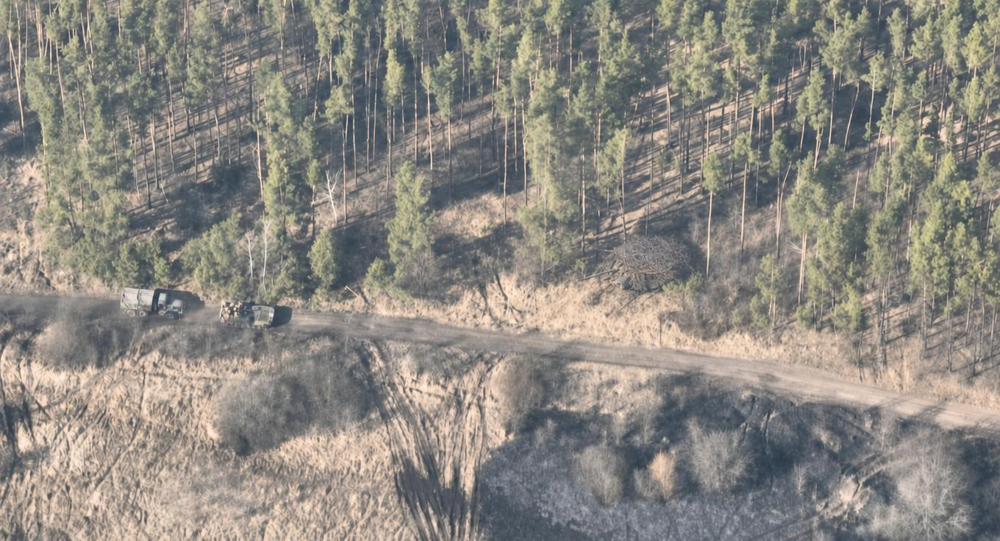
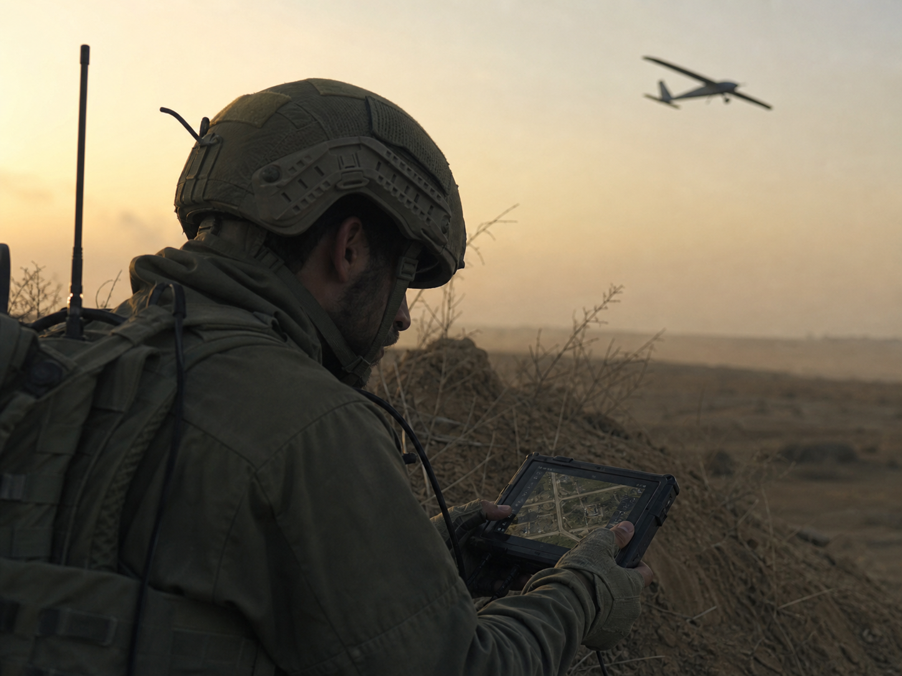
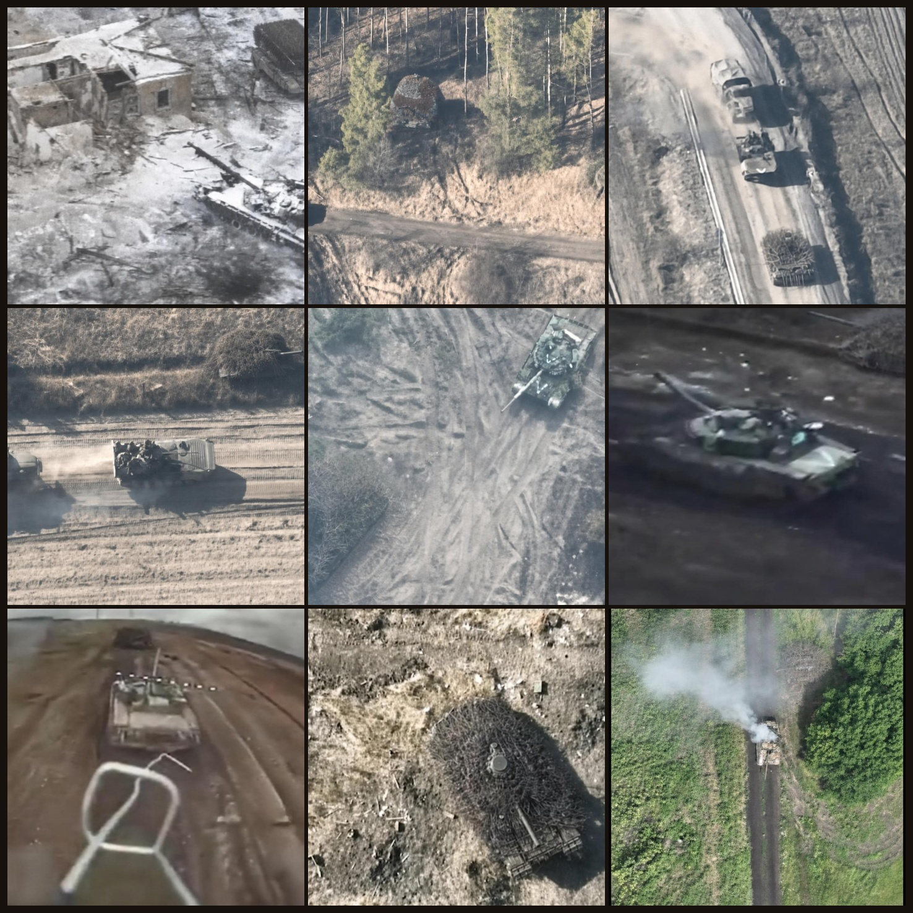
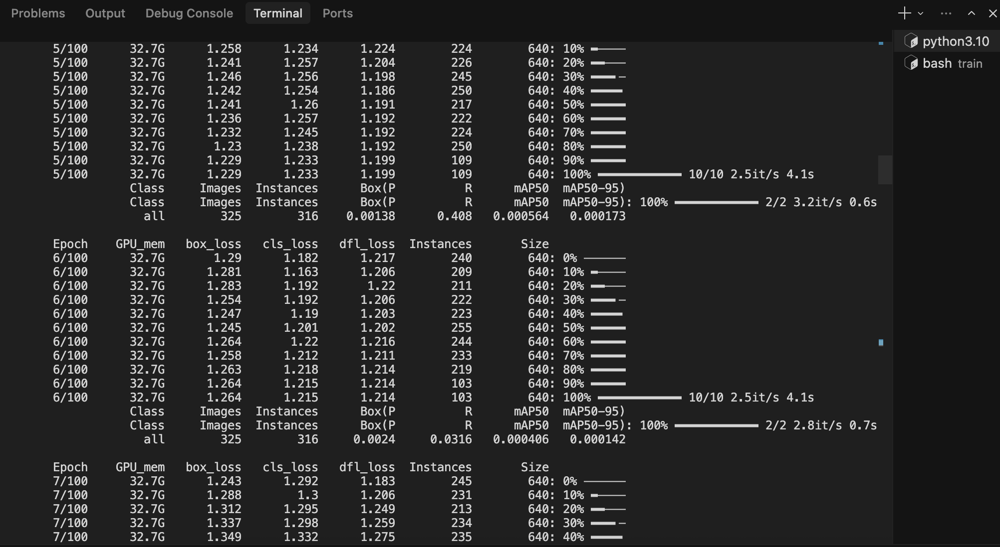
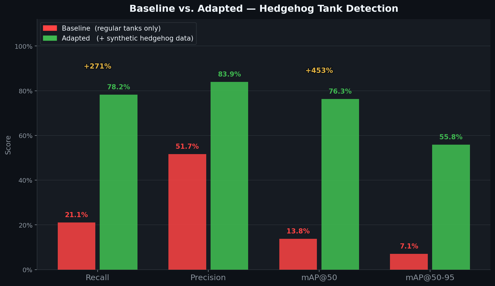
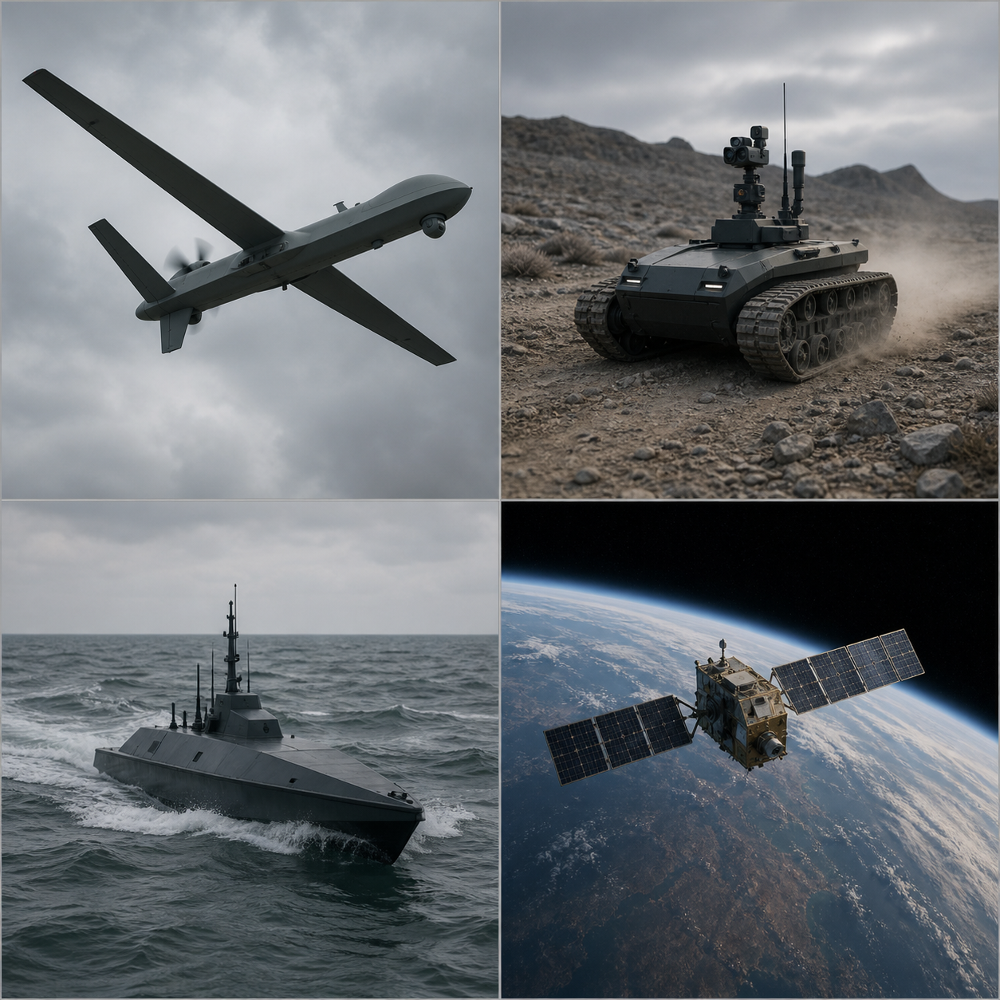

# 60-second demo

---



*Can you find the tank? Neither can the model that crushed this mission yesterday.*

---

## 1. The problem


*The adversary modifies the silhouette — cope cages, hedgehog welding — and a detector that worked yesterday goes blind. Real data takes weeks to collect. The war moves faster.*

---

## 2. Whose problem it is



*The drone operator at the tactical edge. They see exactly what changed in the field — and they have no way to push it back into training.*

---

## 3. How we solve it



*The operator flags the new threat. Generative AI synthesizes the missing training data from a few reference frames.*



*The model fine-tunes overnight on the augmented set.*


*Detection recovers on the same case that broke it yesterday.*



*Across the full eval set: 5× higher mAP, 4× higher recall — not a cherry-picked frame.*



*The same loop applies to any unmanned system — air, land, sea, space — and any target whose appearance shifts on the battlefield.*

---


```
Edge Adaptation for Drone Perception
Roland Pinter · Domonkos Haffner · DiffuseDrive
github.com/roland-diffusedrive/natsechackathon
```
